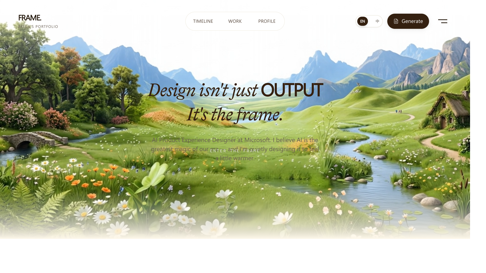

# Frame — Personal Portfolio



**Live Site → [https://albellatross.github.io/frame/](https://albellatross.github.io/frame/)**

A creative portfolio site showcasing design work, IP universe, AI-generated art, and project case studies.

## Tech Stack

- React + TypeScript
- Vite
- Tailwind CSS
- Framer Motion

## Run Locally

```bash
npm install
npm run dev
```

`npm run dev` starts both the Vite site and the local portfolio agent API.

To enable real model-backed answers through GitHub Models, create a GitHub personal access token with `models:read`, then add this to `.env.local`:

```bash
PORTFOLIO_AGENT_PROVIDER=github
GITHUB_TOKEN=your_github_token
PORTFOLIO_AGENT_MODEL=openai/gpt-4.1
PORTFOLIO_AGENT_DEEP_MODEL=openai/gpt-4.1
PORTFOLIO_AGENT_EMBEDDING_MODEL=openai/text-embedding-3-small
PORTFOLIO_AGENT_USE_EMBEDDINGS=false
```

If your organization has enabled attributed GitHub Models usage, you can also add:

```bash
GITHUB_MODELS_ORG=your_org_login
```

Without a configured model token, the Agent UI still works in local fallback mode using the curated portfolio knowledge base.

For a deployed static frontend, set the public API endpoint:

```bash
VITE_PORTFOLIO_AGENT_API_URL=https://your-agent-api.example.com/api/portfolio-agent
```

## Deploy

```bash
npm run build
```

The `dist/` folder can be deployed to any static hosting (Vercel, Netlify, GitHub Pages, etc.).

For production model-backed answers, deploy `scripts/portfolio-agent-server.mjs` or an equivalent serverless API route with the same `/api/portfolio-agent` contract. GitHub Pages is static hosting, so it cannot run this backend by itself. Do not expose `GITHUB_TOKEN`, `GITHUB_MODELS_TOKEN`, or `OPENAI_API_KEY` in frontend code.
